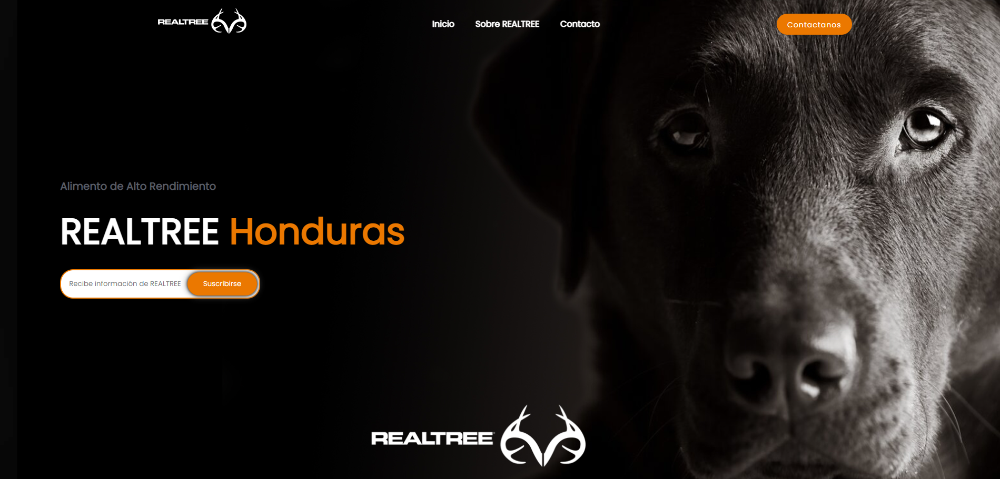
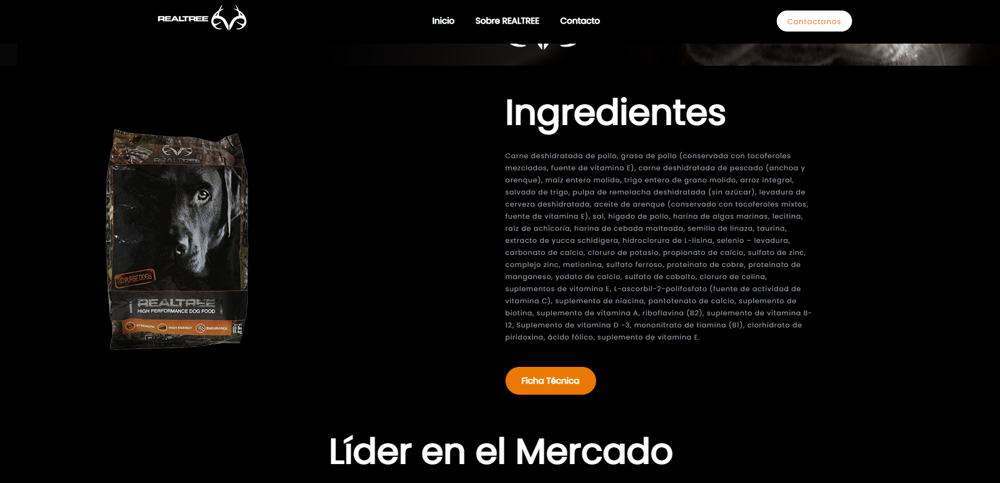
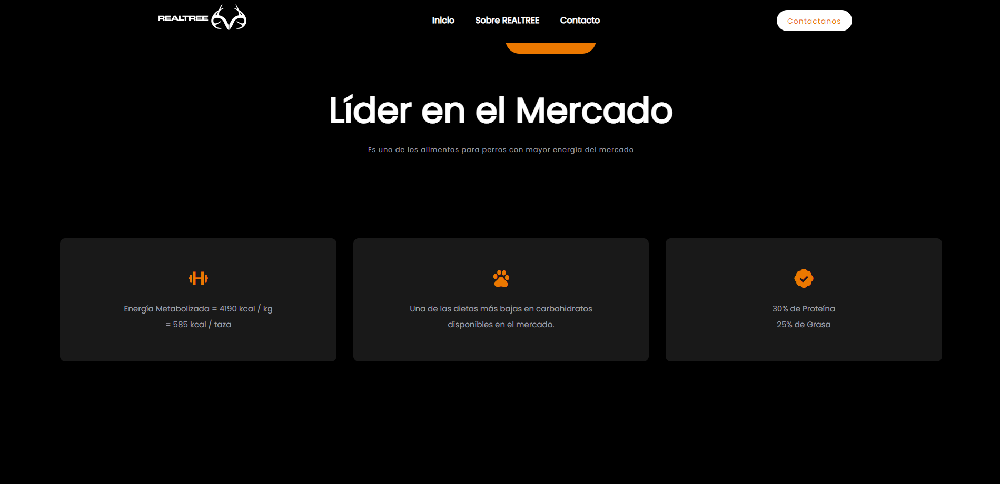
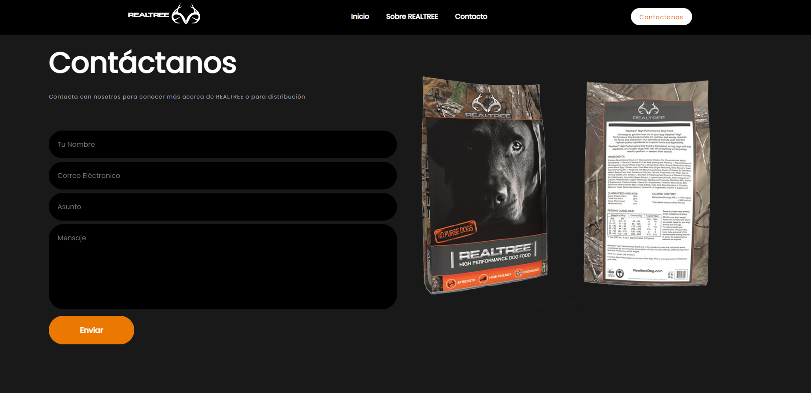

# RealTree Honduras
Official RealTree Honduras website
# RealTree Honduras

Official **REALTREE** website for Honduras and Central America.

### Description

RealTree´s new dog food sports a 30/25 protein-to-fat ratio delivering the highest metabolised energy ratio in the sport dog food category.

This nutrient-dense, low-carb diet is designed for all breeds and life stages to improve performance, maintain proper weight and promote a healthy coat. Realtree High Performance Dog Food is available in two formats a conventional 33lb foil bag and a convenient Adventure Pack containing 12 single serving foil packets designed for mobility in the field.

The chicken-and-fish-based formula is fat-infused to provide quick energy and it requires less feeding, meaning less clean up. To assist with feeding regimes, a “Feed to the Need” guide is available on the Realtree High Performance Dog Food website.  Based on a formulation with proven results in the harsh environments of the Alaskan sled dog racing circuit, Realtree High Performance Dog Food will provide noticeable results in less than a month and the peace of mind of feeding your dog the best.

### Technologies

The following technologies were used for the development of the template:

- HTML
- CSS
- JavaScript

### Design

Developed by @github/eduardodavidmm
